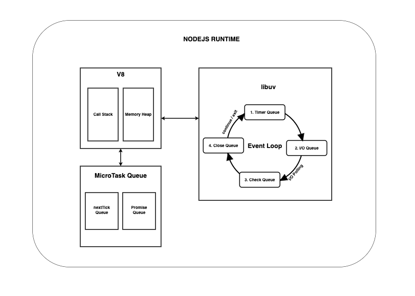

### NODEJS

- Synchronous, Single Threaded , Blocking language.

> JavaScript is synchronous by default. But the runtime provides you with the environment to execute your code in asynchronous manner.

> JavaScript has a single thread by default, and offloads operations to the system kernel whenever possible to free the main thread. since modern kernels are multi-threaded, they can execute multiple operations in the background. when one of these operation is completed, the kernel tells NODEJS, and the appropriate callback is added to the poll queue which will be executed once the call stack is empty.

- Synchronous Tasks are handled by v8.
- Asynchronous ( n/w request, handling files ) Tasks are handled by libuv.



#### Execution Order

- Synchronous JS code takes precedence over async JS code.
- All JS code are executed in v8 CallStack.
- Only after the call stack is emptied, the event loop comes into play.
- within the event loop, each phase executes callback scheduled for that particular queue.
- After Each phase, the callbacks from microTasks are executed.

- Having lots of synchronous code will starve the event loop.

#### Event Loop Starvation

- Event loop phases are not given a chance to execute

```js
// Example
// This program will run infinitely

let stop = false;
setTimeout(() => {
  stop = true;
}, 0);

let i = 0;
while (!stop) {
  console.log(i++);
}
```

- NodeJS continues to execute callbacks from microTask queue until its empty. so adding microTasks within the execution of microTasks will starve the event loop.

```js
// Example
// This program will run infinitely
let stop = false;
setTimeout(() => {
  stop = true;
});

function handlePromise() {
  const func = () => {
    return Promise.resolve('resolved');
  };

  func().then((v) => {
    console.log({ v });
    if (!stop) {
      globalThis.queueMicrotask(() => handlePromise());
    }
  });
}

handlePromise();
```

#### NODEJS EXECUTION ORDER:

1. Synchronous user written JS codes are executed first. and when V8 callStack is empty it will execute microTasks.
2. `MicroTask Queue Execution`: After call stack is emptied, all callbacks in microTask queue is executed.

   - MicroTask Queue has two Queues ( nextTick and promise ).
   - nextTick has precedence over promise queue. only after emptying nextTick queue, promise queue is executed.
   - To move the control to next phase, callbacks from both queues should be empty.

3. `Timers Phase` : Callbacks of completed timer from timer queues are pushed to v8 one by one and executed. on every callback execution the control is passed to microTask and back.
4. `MicroTask Queue Execution`: After Each callback execution in Timers Phase, microTask is checked, and if it has callbacks, they are executed and control is passed back to timers Phase.
5. `I/O Pending Callback Phase` : This phase executes deferred callbacks for some system operations such as types of TCP errors.
   Example: `ECONNREFUSED` when attempting to connect. some unix systems want to wait to report the error. This callback will be deferred to execute in the pending callbacks phase.
6. `I/O Polling / Poll Phase` : Polls or executes callbacks of almost all I/O operations (http,socket,fs,etc) except close callbacks, the ones scheduled by timers and setImmediate.
   When event loop enters Poll Phase, one of the two things happen:

   1. if poll / (I/O) queue is not empty, Callbacks are pushed to V8 one by one and executed. on every callback execution the control is passed to microTask and back.
   2. if poll queue is empty, one of the two things will happen:
      i. if `setImmediate()` queue has callbacks, it will end poll phase and move to check phase.
      ii. if not, NODEJS might block the event loop and poll for i/o operations to complete and add corresponding callbacks to the poll queue and execute them immediately.
      once the poll queue is empty, the control is passed to the timers phase.

7. `MicroTask Queue Execution`: After Each callback execution in I/O Poll Phase, microTask is checked, and if it has callbacks, they are executed and control is passed back to I/O Poll Phase.
8. `Check Phase` : Each callbacks from check queue are pushed to V8 callStack one by one and executed. on every callback execution the control is passed to microTask and back.
9. `MicroTask Queue Execution`: After Each callback execution in Check Phase, microTask is checked, and if it has callbacks, they are executed and control is passed back to Check Phase. 10. `Close Callbacks Phase`: Each callbacks from Close queue are pushed to V8 callStack one by one and executed. on every callback execution the control is passed to microTask and back.
10. `MicroTask Queue Execution`: After Each callback execution in Close Phase, microTask is checked, and if it has callbacks, they are executed and control is passed back to Close Phase.

```
 ------------------------------------------------------------------------------------------------
|                                                                                                |
|              -----------------------------------                                               |
|        |---->|  nextTickQueue -> promises       |                                              |
|        |     -----------------------------------                                               |
|        |                     |                                                                 |
|        |     -----------------------------------       -----------------------------------     |
|         ---->|             TIMERS              |<---->|  nextTickQueue -> promises        |    |
|        |     -----------------------------------       -----------------------------------     |
|        |                     |                                                                 |
|        |                     |                                                                 |
|        |     -----------------------------------       -----------------------------------     |
|         ---->|          I/O Pending CALLBACKS  |<---->|  nextTickQueue -> promises        |    |
|        |     -----------------------------------       -----------------------------------     |
|        |                     |                                                                 |
|        |                     |                                                                 |
|        |     -----------------------------------       -----------------------------------     |
|         ---->|          I/O POLLING            |<---->|  nextTickQueue -> promises        |    |
|        |     -----------------------------------       -----------------------------------     |
|        |                     |                                                                 |
|        |                     |                                                                 |
|        |     -----------------------------------       -----------------------------------     |
|         ---->|      setImmediate CALLBACKS     |<---->|  nextTickQueue -> promises        |    |
|        |     -----------------------------------       -----------------------------------     |
|        |                     |                                                                 |
|        |                     |                                                                 |
|        |     -----------------------------------       -----------------------------------     |
|         ---->|        CLOSE CALLBACKS          |<---->|  nextTickQueue -> promises        |    |
|        |     -----------------------------------       -----------------------------------     |
|                                                                                                |
|                                                                                                |
|                                                                                                |
 -------------------------------------------------------------------------------------------------
```

#### MicroTasks

- NodeJS implementation of MicroTask differs from the Browser Implementation.
- NodeJS provides a wrapper around a v8's microTask queue to give a predictable behavior.
- The priority of nextTick queue is higher than promise queue which is not the case in browser. in fact browser do not support nextTick api

#### CommonJS VS ES Modules

- Es modules being loaded is wrapped as an asynchronous operation, and thus the entire script is in promises microTask queue.

- The following script will yield different output based on the extension of the file

| .js                   | .mjs                  |
| --------------------- | --------------------- |
| start foo bar zoo baz | start bar foo zoo baz |

```js
const baz = () => console.log('baz');
const foo = () => console.log('foo');
const zoo = () => console.log('zoo');

const start = () => {
  console.log('start');
  setImmediate(baz);
  new Promise((resolve, reject) => {
    resolve('bar');
  }).then((resolve) => {
    console.log(resolve);
    process.nextTick(zoo);
  });
  process.nextTick(foo);
};

start();
```

#### Profile your application

```bash
$ node --prof program.<js|mjs>
```

#### Expose garbage collector for debugging memory issues

```bash
$ node --expose-gc --inspect program.<js|mjs>
```

### Trace events in nodejs

```bash
$ node --trace-event-categories=v8,node.async_hooks program.<js|mjs>
$ node --trace-event-categories=v8,node.async_hooks,node,node.bootstrap,node.perf,node.threadpoolwork.sync,node.threadpoolwork.async program.<js|mjs>
```

#### Garbage Collector Traces

```bash
$ node --trace-gc program.<js|mjs>
```

#### Increase the heap memory for the program

```bash
$ node --max-old-space-size=6000 program.<js|mjs>
```

#### Increase the thread poll size of libuv. ( default = 4, max = 1024 )

```bash
$ UV_THREADPOOL_SIZE=<number> node program.<js|mjs>
```

```js
// dynamically adjust threadpool size
const os = require('os');
process.env.UV_THREADPOOL_SIZE = os.cpus().length;
```
